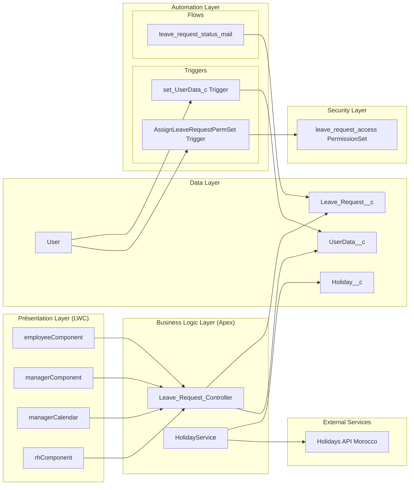
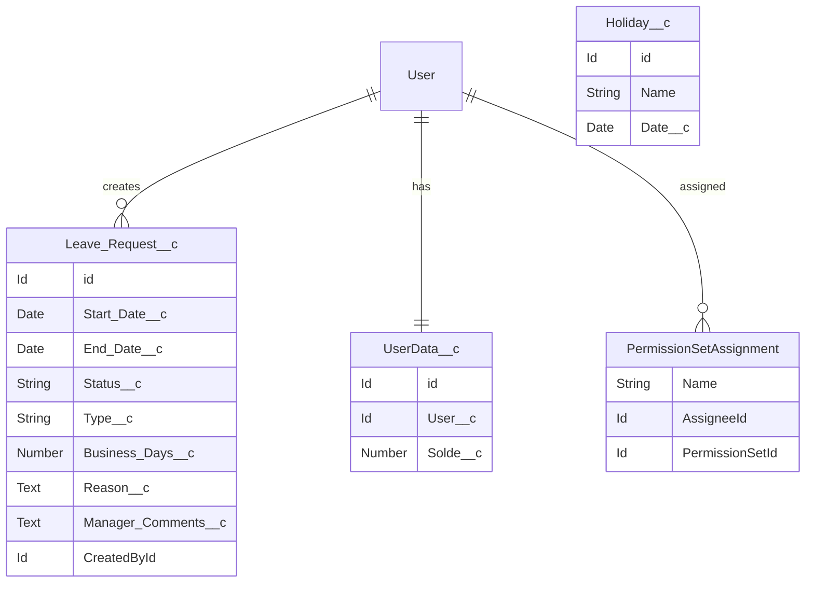
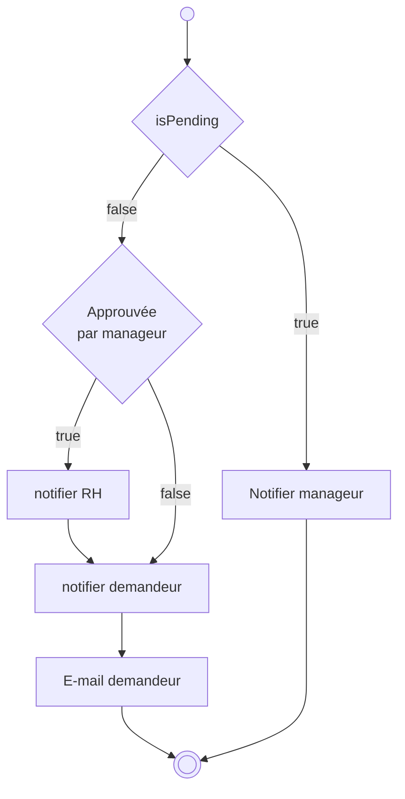
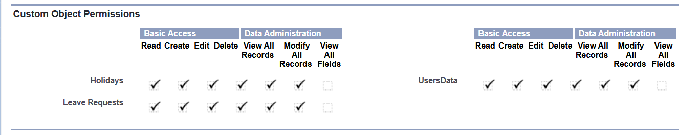
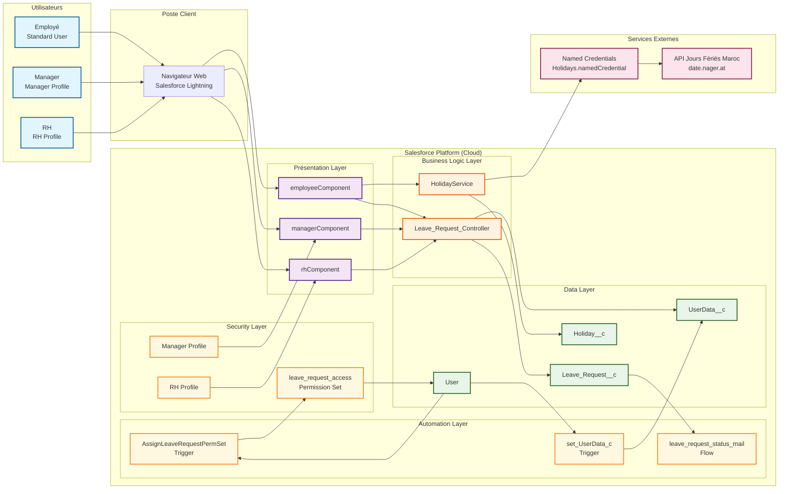

<link rel="stylesheet" href="style.css">

# Documentation Technique - Portail de Gestion des Demandes de Congés
 
**Date:** 31 août 2025  
**Auteurs:**
- [Houda EL BEKKARI](https://github.com/Houda-El-Bekkari)
- [Moad CHERGUI](https://github.com/moad-cher)

**Projet:** Portail collaboratif de gestion des demandes de congés et absences

---

## 📋 Table des Matières

1. [🏗️ Vue d'ensemble](#-vue-densemble)
2. [🏛️ Architecture Technique](#️-architecture-technique)
3. [📊 Modèle de Données](#-modèle-de-données)
4. [⚙️ Classes Apex](#️-classes-apex)
5. [🔧 Automation](#-automation)
6. [🎨 Lightning Web Components](#-lightning-web-components)
7. [🔗 Intégrations](#-intégrations)
8. [🧪 Tests et Couverture](#-tests-et-couverture)
9. [🔐 Sécurité et Permissions](#-sécurité-et-permissions)
10. [🚀 Déploiement](#-déploiement)
11. [🔧 Support et Dépannage](#support-et-dépannage)

---

## 🏗️ Vue d'ensemble

### Objectif du Projet
Le portail de gestion des demandes de congés est une solution Salesforce complète permettant aux employés de soumettre des demandes de congés via une interface moderne et intuitive, avec un workflow d'approbation à deux niveaux (Manager → RH) et une gestion automatisée des permissions utilisateurs.

### Technologies Utilisées
- **Plateforme:** Salesforce Lightning Platform
- **Frontend:** Lightning Web Components (LWC)
- **Backend:** Apex Classes et Triggers
- **Automation:** Triggers + Flow Builder
- **Intégrations:** REST API (jours fériés)
- **Testing:** Apex Test Classes (100% couverture)
- **Sécurité:** Profiles et Permission Sets avec assignment automatique

---

## 🏛️ Architecture Technique

### Architecture Globale



### Patterns d'Architecture
- **MVC Pattern:** Séparation claire entre composants LWC (View), Controllers Apex (Controller), et objets Salesforce (Model)
- **Service Layer:** HolidayService pour l'intégration API
- **Repository Pattern:** Classes Controller agissent comme repositories
- **Observer Pattern:** Triggers pour automation et Flows pour notifications
- **Auto-Provisioning Pattern:** Assignment automatique des permissions via triggers

---

## 📊 Modèle de Données

### Objets Personnalisés

#### Leave_Request__c (Demande de Congé)
```java
// Champs principaux
Start_Date__c (Date) - Date de début
End_Date__c (Date) - Date de fin  
Status__c (Picklist) - Statut de la demande
Reason__c (Text Long) - Motif/Description
Type__c (Picklist) - Type de congé
Business_Days__c (Number) - Nombre de jours ouvrables
Manager_Comments__c (Text Long) - Commentaires du manager/RH
CreatedBy (Lookup to User) - Demandeur
```

**Valeurs de Status__c:**
- `Pending` - En attente
- `ManagerApproved` - Approuvé par le manager
- `Approved` - Approuvé définitivement (RH)
- `Rejected` - Rejeté

**Valeurs de Type__c:**
- `Vacation` - Congé payé
- `Sick Leave` - Congé maladie
- `Training Leave` - Formation
- `Compensatory Time Off` - RTT

#### UserData__c (Données Utilisateur)
```java
// Champs principaux
User__c (Lookup to User) - Utilisateur
Solde__c (Number) - Solde de congés disponibles (défaut: 22)
Name (Auto-generated) - "{User.Name} - Leave Data"
```

#### Holiday__c (Jours Fériés)
```java
// Champs principaux  
Name (Text) - Nom du jour férié
Date__c (Date) - Date du jour férié
```

### Relations Entre Objets



---

## ⚙️ Classes Apex

### Leave_Request_Controller.cls

**Responsabilité:** Gestion CRUD des demandes de congés et logique métier d'approbation

```java
public with sharing class Leave_Request_Controller {
    
    // Méthodes CRUD
    @AuraEnabled(cacheable=true)
    public static List<Leave_Request__c> getRequests()
    
    @AuraEnabled(cacheable=true)
    public static List<Leave_Request__c> getMyRequests()
    
    @AuraEnabled(cacheable=true)
    public static List<Leave_Request__c> getAllRequests()
    
    @AuraEnabled
    public static Leave_Request__c createRequest(Leave_Request__c request)
    
    @AuraEnabled
    public static Leave_Request__c updateRequest(Leave_Request__c request)
    
    @AuraEnabled
    public static void deleteRequest(Id requestId)
    
    // Workflow d'approbation Manager
    @AuraEnabled
    public static void approveRequest(Id requestId, String comments)
    
    @AuraEnabled
    public static void rejectRequest(Id requestId, String comments)
    
    // Workflow d'approbation RH
    @AuraEnabled
    public static void approveRequestByRH(Id requestId, String comments)
    
    @AuraEnabled
    public static void rejectRequestByRH(Id requestId, String comments)
    
    // Gestion des soldes
    @AuraEnabled(cacheable=true)
    public static Decimal getSolde()
    
    @AuraEnabled
    public static Decimal getDeltaSolde(Date startDate, Date endDate)
}
```

**Règles Métier Implémentées:**
- Seules les demandes "Pending" peuvent être modifiées par l'employé
- Vérification du solde avant approbation manager
- Déduction automatique du solde lors de l'approbation RH finale
- Calcul des jours ouvrables excluant weekends et fériés
- Validation des transitions de statut (Pending → ManagerApproved → Approved/Rejected)


### HolidayService.cls

**Responsabilité:** Intégration avec l'API des jours fériés et gestion des données de vacances

```java
public with sharing class HolidayService {
    
    // Récupération depuis l'API externe + Enregistrement
    @AuraEnabled(cacheable=true)
    public static List<Holiday__c> fetchHolidays(Integer year)
    
    // Récupération des jours fériés enregistrés
    @AuraEnabled(cacheable=true)
    public static List<Holiday__c> getHolidays_MA()

}
```

**Fonctionnalités:**
- Appel REST vers l'API des jours fériés du Maroc
- transformations de données json pour stockage

---
## Automation
### 🔧 Triggers

#### set_UserData_c.trigger

**Type:** After Insert sur User  
**Responsabilité:** Création automatique des données utilisateur

```java
trigger set_UserData_c on User (after insert) {
    List<UserData__c> userDataToInsert = new List<UserData__c>();
    for(User u : Trigger.new) {
        if(u.IsActive) {
            UserData__c userData = new UserData__c();
            userData.User__c = u.Id;
            userData.Solde__c = 22; // Solde annuel standard
            userData.Name = u.Name + ' - Leave Data';
            userDataToInsert.add(userData);
        }
    }
    
    if(!userDataToInsert.isEmpty()) {
        insert userDataToInsert;
    }
}
```

**Fonctionnalités:**
- Création automatique d'un UserData__c pour chaque nouvel utilisateur actif
- Attribution d'un solde par défaut de 22 jours
- Naming convention automatique


#### AssignLeaveRequestPermSet.trigger

**Type:** After Insert, After Update sur User  
**Responsabilité:** Assignment automatique des permissions

```java
trigger AssignLeaveRequestPermSet on User (after insert, after update) {
    // Logique d'assignment du Permission Set 'leave_request_access'
    // uniquement pour les utilisateurs avec profil 'Standard User' actifs
    
    // Collecte des utilisateurs éligibles (BULK PROCESSING)
    Set<Id> userIdsToAssign = new Set<Id>();
    for (User u : Trigger.new) {
        if (u.ProfileId == stdProfileId && u.IsActive) {
            userIdsToAssign.add(u.Id);
        }
    }
    
    // Vérification des assignments existants
    // Assignment uniquement si pas déjà assigné
    // Gestion d'erreurs avec try-catch
}
```

**Fonctionnalités:**
- Assignment automatique du Permission Set `leave_request_access`
- Filtrage par profil (Standard User uniquement)
- Vérification des assignments existants pour éviter les doublons
- Gestion d'erreurs robuste

---
### 🔄 Flows

#### leave_request_status_mail

**Fichier:** leave_request_status_mail.flow-meta.xml

**Type:** Record-Triggered Flow  
**Déclencheur:** Modification du statut dans Leave_Request__c

**Fonctionnalités:**
- Notification email automatique lors des changements de statut
- Templates email personnalisés par statut
- Notification des parties prenantes (employé, manager, RH)

**Workflow de Notifications:**


---

## 🎨 Lightning Web Components

### employeeComponent

**Dossier:** : `employeeComponent`

**Responsabilité:** Interface principale pour la création et gestion des demandes

**Fonctionnalités:**
- Calendrier interactif avec sélection de dates
- Formulaire de saisie avec validation client-side
- Affichage du solde utilisateur
- Liste des demandes personnelles avec actions
- Calcul automatique des jours ouvrables
- Gestion des types de congés
- Interface responsive

### managerComponent

**Dossier:**: `managerComponent`

**Responsabilité:** Interface de validation pour les managers

**Fonctionnalités:**
- Vue d'ensemble des demandes en attente
- Actions d'approbation/rejet avec commentaires
- Modal de validation avec détails complets
- Tableau de bord des demandes par statut


### rhComponent

**Dossier:**: `rhComponent`

**Responsabilité:** Interface de validation finale pour les RH

**Fonctionnalités:**
- Validation des demandes pré-approuvées par les managers
- Approbation finale avec déduction de solde
- Vue globale de toutes les demandes

---


## 🔗 Intégrations

### API Jours Fériés Maroc

**Named Credentials:** `Holidays.namedCredential-meta.xml`

**Endpoint:** `https://date.nager.at/api/v3/PublicHolidays/{year}/MA`
- **Méthode:** GET
- **Timeout:** 20 secondes  
- **Format:** JSON
- **Authentification:** Anonymous

**Gestion d'Erreurs:**
- Retry automatique sur timeout
- Fallback vers données en cache
- Logging des erreurs pour monitoring
- Graceful degradation si API indisponible

---

## 🧪 Tests et Couverture

### Leave_Request_Controller_Test.cls

**Couverture:** 100%  
**Nombre de méthodes:** 23 tests

```java
@isTest
private class Leave_Request_Controller_Test {

    @TestSetup
    static void makeData() // Configuration des données de test
    
    // Tests des triggers
    testUserDataTrigger()
    testPermissionSetAssignmentTrigger()
    testTriggerBulkProcessing()
    testInactiveUserTrigger()
    
    // Tests CRUD basiques
    testGetRequests()
    testGetMyRequests() 
    testCreateRequest()
    testUpdatePendingRequest()
    testUpdateRequest_NonPendingRequest()
    testDeleteRequest()
    testGetAllRequests()
    
    // Tests workflow Manager
    testApproveRequest_Success()
    testApproveRequest_InsufficientBalance()
    testRejectRequest_Success()
    
    // Tests workflow RH  
    testApproveRequestByRH_Success()
    testApproveRequestByRH_InvalidStatus()
    testRejectRequestByRH_Success()
    
    // Tests logique métier
    testGetSolde()
    testGetDeltaSolde_WithHolidays()
    testGetDeltaSolde_WeekendOnly()
    
    // Tests couverture code
    testTriggerCodeCoverage()
    testPermissionSetNotFound()
}
```

### Stratégie de Test

**Données de Test:**
- Création d'utilisateurs avec profils Standard User
- Génération automatique de UserData__c via triggers
- Données de congés avec différents statuts
- Jours fériés pour test des calculs

**Cas de Test Couverts:**
- [x] Création/modification/suppression de demandes
- [x] Workflows d'approbation complets
- [x] Validation des règles métier
- [x] Gestion des erreurs et cas limites
- [x] Tests des triggers avec traitement bulk
- [x] Tests des permissions et sécurité
- [x] Calculs de jours ouvrables avec jours fériés

### Couverture de Code

| Classe/Trigger | Couverture | Statut |
|----------------|:----------:|:------:|
| Leave_Request_Controller | 100% | ✅ |
| HolidayService | 100% | ✅ |
| set_UserData_c | 100% | ✅ |
| AssignLeaveRequestPermSet | 100% | ✅ |
| **Total Projet** | **100%** | ✅ |

><u>**NB:**</u> désactivez le flow avant d'éxecuter les testes

---

## 🔐 Sécurité et Permissions

### Permission Set: leave_request_access

```xml
<PermissionSet xmlns="http://soap.sforce.com/2006/04/metadata">
    <classAccesses>
        <apexClass>HolidayService</apexClass>
        <enabled>true</enabled>
    </classAccesses>
    <classAccesses>
        <apexClass>Leave_Request_Controller</apexClass>
        <enabled>true</enabled>
    </classAccesses>
    <objectPermissions>
        <allowCreate>true</allowCreate>
        <allowDelete>true</allowDelete>
        <allowEdit>true</allowEdit>
        <allowRead>true</allowRead>
        <modifyAllRecords>false</modifyAllRecords>
        <object>Leave_Request__c</object>
        <viewAllFields>true</viewAllFields>
        <viewAllRecords>false</viewAllRecords>
    </objectPermissions>
</PermissionSet>
```

**Permissions Accordées:**
- Accès complet aux classes Apex du portail
- CRUD on Leave_Request__c (sans Modify All Records pour sécurité)
- Assignment automatique aux utilisateurs Standard User actifs (profil inmodifiable)

**Sécurité Implementée:**
- Row-level security via `with sharing` dans toutes les classes
- Validation des permissions dans les triggers
- Principe de moindre privilège

### Permissions des Profiles

#### Manager Profile


#### RH Profile


### Acces aux classes Apex
`Setup`$\rightarrow$
`Apex Classes`$\rightarrow$
`Leave_Request_Controlle`/`HolidayService`$\rightarrow$
`security`$\rightarrow$ 
selectionnez **Manager Profile** et **RH Profile** depuit **Available Profiles** pui clickez `add`

---

## 🚀 Déploiement




### Ordre de Déploiement Recommandé

1. **Named Credentials** (Holidays_MA, Holidays)
2. **Objets personnalisés** (Holiday__c, UserData__c, Leave_Request__c)
3. **Permission Set** (leave_request_access)
4. **Classes Apex** (HolidayService, Leave_Request_Controller)
5. **Triggers** (set_UserData_c, AssignLeaveRequestPermSet)
6. **Classes de test** (Leave_Request_Controller_Test)
7. **Lightning Web Components** (employeeComponent, managerComponent, etc.)
8. **Flows** (leave_request_status_mail)


### Post-Déploiement

#### **Initialisation des jours fériés et des solde**
```bash
sf apex execute -f scripts/apex/yearly_script.apex --target-org [org name]
```

#### **Activation du flow**

`Setup`$\rightarrow$
`Flows`$\rightarrow$
`leave_request_status_mail`$\rightarrow$
**`Activate`**

#### Création de profils et configuration des accès

Création des profils **Manager Profile** et **RH Profile**, et modification de leur accès aux classes Apex comme indiqué dans la partie <u>***Sécurité et Permissions***</u>

#### edit page
⚙️ $\rightarrow$
`edit page`$\rightarrow$
ajoutez les trois composant LWC$\rightarrow$
filtre de visibilité selon le profile (dans l’éditeur de page):  
- **employeeComponent**: *Standard User*
- **managerComponent**: *Manager Profile*
- **rhComponent**: *RH Profile*


<!-- 
---

## 🔧 Maintenance

### Scripts de Maintenance

#### 1. yearly_script.apex - Remise à Zéro Annuelle
```java
// Remise à zéro des soldes annuels
List<UserData__c> users = [SELECT Id, Solde__c FROM UserData__c];
for (UserData__c user : users) {
    user.Solde__c = 22; // Solde annuel standard
}
update users;

// Synchronisation des jours fériés année suivante  
HolidayService.fetchHolidays(Date.today().year() + 1);
```
-->

---

## Support et Dépannage

### Problèmes Courants et Solutions

#### Le menu `Leave Type` ne fonctionne pas
**Cause**: Permission Set n'est pas assigné  
**Solution**: Modifier les informations d'utilisateur (car le Trigger se déclenche avec l'insertion et modification)

#### Erreur de soumission de demande 
**Cause**: le Flow envoie de notification au manageur d'utilisateur s'il n'y a pas de manager , the flow breaks  
**Solution**: en dois assigner un manager à chaque employé (Standard user)

#### Erreur d'aprouver la demande par manager
**Cause**: le Flow envoie de notification à chaque utilisateur de profile ***RH Profile***, s'il n'y a pas de RH, the flow breaks  
**Solution**: en dois avoir au moins un utilisateur de profile ***RH Profile***

#### Erreur API Jours Fériés
**Symptôme:** Calculs incorrects des jours ouvrables et aucun jour férié n'apparait dans les calendrier   
**Cause:** API externe indisponible ou Named Credential mal configuré  
**Solution:** Vérifier la connectivité, effectuer un import manuel des jours fériés si nécessaire, ou mettre à jour le Named Credential avec l'URL de l'API (c'est publique).

#### Flow de notification non déclenché
**Symptôme:** Emails non envoyés lors des changements de statut  
**Cause:** Flow désactivé ou problème de template  
**Solution:** Vérifier activation du flow `leave_request_status_mail` , les email peuvent étre dans le spam


---

## Améliorations Possibles
- Workflow d'approbation configurable par département
- Gestion multi-devises pour entreprises internationales
- Intégration systèmes RH externes
- Dashboard temps réel pour managers

---
