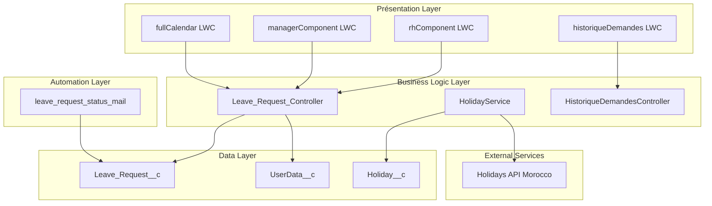
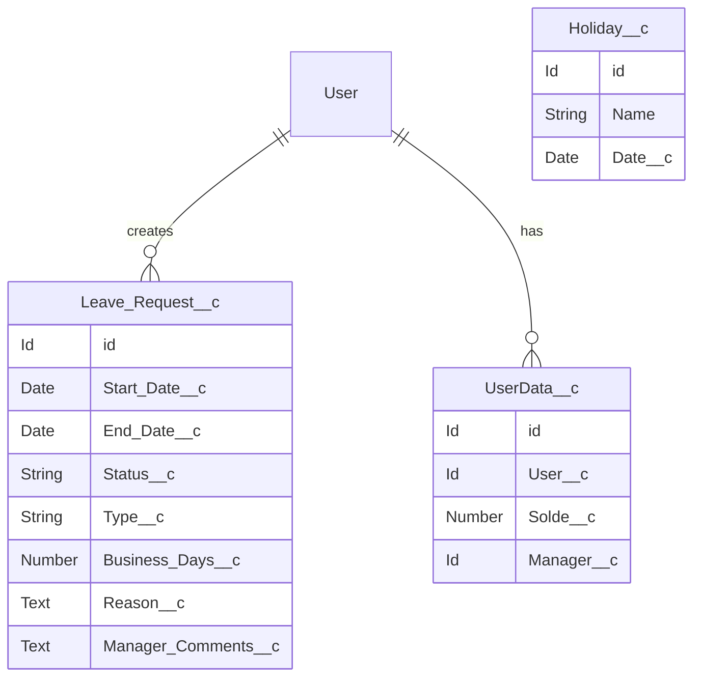
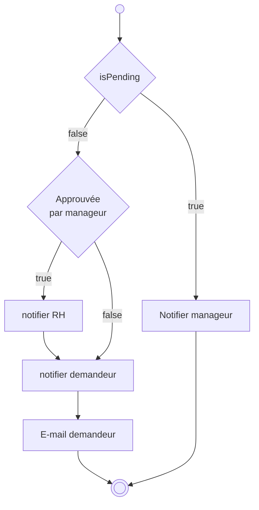

<link rel="stylesheet" href="style.css">

# Documentation Technique - Portail de Gestion des Demandes de Congés

**Version:** 1.0  
**Date:** 26 août 2025  
**Auteur:** Équipe de développement  
**Projet:** Portail collaboratif de gestion des demandes de congés et absences

---

## 📋 Table des Matières

1. Vue d'ensemble
2. Architecture Technique
3. Modèle de Données
4. Classes Apex
5. Lightning Web Components
6. Flows et Automatisations
7. Intégrations
8. Tests et Couverture
9. Déploiement
10. Maintenance

---

## 🏗️ Vue d'ensemble

### Objectif du Projet
Le portail de gestion des demandes de congés est une solution Salesforce complète permettant aux employés de soumettre des demandes de congés via une interface moderne et intuitive, avec un workflow d'approbation à deux niveaux (Manager → RH).

### Technologies Utilisées
- **Plateforme:** Salesforce Lightning Platform
- **Frontend:** Lightning Web Components (LWC)
- **Backend:** Apex Classes
- **Automation:** Flow Builder
- **Intégrations:** REST API (jours fériés)
- **Testing:** Apex Test Classes

---

## 🏛️ Architecture Technique

### Architecture Globale



### Patterns d'Architecture
- **MVC Pattern:** Séparation claire entre composants LWC (View), Controllers Apex (Controller), et objets Salesforce (Model)
- **Service Layer:** HolidayService pour l'intégration API
- **Repository Pattern:** Classes Controller agissent comme repositories
- **Observer Pattern:** Flows déclenchés par les changements de statut

---

## 📊 Modèle de Données

### Objets Personnalisés

#### Leave_Request__c (Demande de Congé)
```java
// Champs principaux
Start_Date__c (Date) - Date de début
End_Date__c (Date) - Date de fin  
Status__c (Picklist) - Statut de la demande
Reason__c (Text Long) - Motif/Description
Type__c (Picklist) - Type de congé
Business_Days__c (Number) - Nombre de jours ouvrables
Manager_Comments__c (Text Long) - Commentaires du manager
CreatedBy (Lookup to User) - Demandeur
```

**Valeurs de Status__c:**
- `Pending` - En attente
- `ManagerApproved` - Approuvé par le manager
- `Approved` - Approuvé définitivement (RH)
- `Rejected` - Rejeté

**Valeurs de Type__c:**
- `Vacation` - Congé payé
- `Sick Leave` - Congé maladie
- `Training Leave` - Formation
- `Compensatory Time Off` - RTT

#### 2. UserData__c (Données Utilisateur)
```java
// Champs principaux
User__c (Lookup to User) - Utilisateur
Solde__c (Number) - Solde de congés disponibles
Manager__c (Lookup to User) - Manager de l'utilisateur
```

#### 3. Holiday__c (Jours Fériés)
```java
// Champs principaux  
Name (Text) - Nom du jour férié
Date__c (Date) - Date du jour férié
```

### Relations Entre Objets



---

## ⚙️ Classes Apex

### 1. Leave_Request_Controller.cls

**Responsabilité:** Gestion CRUD des demandes de congés et logique métier d'approbation

```java
public with sharing class Leave_Request_Controller {
    
    // Méthodes de consultation
    @AuraEnabled(cacheable=true)
    public static List<Leave_Request__c> getRequests()
    
    @AuraEnabled(cacheable=true)
    public static List<Leave_Request__c> getMyRequests()
    
    @AuraEnabled(cacheable=true)
    public static List<Leave_Request__c> getAllRequests()
    
    // Méthodes CRUD
    @AuraEnabled
    public static Leave_Request__c createRequest(Leave_Request__c request)
    
    @AuraEnabled
    public static Leave_Request__c updateRequest(Leave_Request__c request)
    
    @AuraEnabled
    public static void deleteRequest(Id requestId)
    
    // Workflow d'approbation Manager
    @AuraEnabled
    public static void approveRequest(Id requestId, String comments)
    
    @AuraEnabled
    public static void rejectRequest(Id requestId, String comments)
    
    // Workflow d'approbation RH
    @AuraEnabled
    public static void approveRequestByRH(Id requestId, String comments)
    
    @AuraEnabled
    public static void rejectRequestByRH(Id requestId, String comments)
    
    // Gestion des soldes
    @AuraEnabled(cacheable=true)
    public static Decimal getSolde()
    
    @AuraEnabled
    public static Decimal getDeltaSolde(Date startDate, Date endDate)
}
```

**Règles Métier Implémentées:**
- Seules les demandes "Pending" peuvent être modifiées
- Vérification du solde avant approbation
- Déduction automatique du solde lors de l'approbation
- Calcul des jours ouvrables excluant weekends et fériés
- Validation des transitions de statut

### 2. HolidayService.cls

**Responsabilité:** Intégration avec l'API des jours fériés et gestion des données de vacances

```java
public with sharing class HolidayService {
    
    // Récupération depuis l'API externe
    @AuraEnabled(cacheable=true)
    public static List<Map<String, String>> getHolidays()
    
    // Synchronisation et persistance
    @AuraEnabled(cacheable=true)
    public static List<Holiday__c> fetchHolidays(Integer year)
    
    // Accès aux données locales
    @AuraEnabled(cacheable=true)
    public static List<Holiday__c> getHolidays_MA()
}
```

**Fonctionnalités:**
- Appel REST vers l'API des jours fériés du Maroc
- Mise en cache des données pour performance
- Gestion d'erreurs et fallback
- Synchronisation annuelle automatisée

### 3. HistoriqueDemandesController.cls

**Responsabilité:** Gestion de l'historique et des statistiques des demandes

```java
public with sharing class HistoriqueDemandesController {
    
    @AuraEnabled(cacheable=true)
    public static List<Leave_Request__c> getHistoricalRequests()
    
    @AuraEnabled(cacheable=true) 
    public static Map<String, Integer> getRequestsStats()
}
```

---

## 🎨 Lightning Web Components

### 1. fullCalendar

**Fichier:** fullCalendar

**Responsabilité:** Interface principale pour la création et gestion des demandes

**Fonctionnalités:**
- Calendrier interactif avec Flatpickr
- Formulaire de saisie avec validation
- Affichage du solde utilisateur
- Liste des demandes personnelles
- Calcul en temps réel des jours ouvrables

```javascript
// Structure principale
export default class FullCalendar extends LightningElement {
    // État du composant
    @track holidays = [];
    @track userBalance = 0;
    @track deltaSolde = 0;
    
    // Données du formulaire
    @track startDate = '';
    @track endDate = '';  
    @track reason = '';
    @track type = '';
    
    // Méthodes principales
    connectedCallback()           // Initialisation
    handleSubmit()               // Soumission du formulaire
    validateRequiredFields()     // Validation
    updateDeltaSolde()          // Calcul des jours
}
```

**Intégrations:**
- **Flatpickr:** Sélecteur de dates avancé
- **FullCalendar.js:** Affichage calendaire
- **Wire Services:** Récupération des données en temps réel

### 2. managerComponent

**Fichier:** managerComponent

**Responsabilité:** Interface de validation pour les managers

**Fonctionnalités:**
- Vue d'ensemble des demandes en attente
- Actions d'approbation/rejet
- Commentaires de validation
- Tableau de bord des demandes par statut

```javascript
export default class ManagerComponent extends LightningElement {
    // Données
    @track requestsData = [];
    @track selectedRequestForApproval = null;
    @track approvalComments = '';
    
    // Actions
    handleApproval(event)    // Approbation
    handleRejection(event)   // Rejet  
    openApprovalModal(event) // Interface de validation
}
```

### 3. rhComponent

**Fichier:** rhComponent

**Responsabilité:** Interface de validation finale pour les RH

**Fonctionnalités:**
- Validation des demandes pré-approuvées
- Approbation finale ou rejet
- Vue globale de toutes les demandes

### 4. historiqueDemandes

**Fichier:** historiqueDemandes

**Responsabilité:** Affichage de l'historique et statistiques

**Fonctionnalités:**
- Historique complet des demandes
- Filtres par statut, date, type
- Statistiques et rapports visuels

---

## 🔄 Flows et Automatisations

### 1. leave_request_status_mail

**Fichier:** leave_request_status_mail.flow-meta.xml

**Type:** Record-Triggered Flow  
**Déclencheur:** Modification du statut dans Leave_Request__c

**Fonctionnalités:**
- Notification email automatique lors des changements de statut
- Templates email personnalisés par statut
- Notification des parties prenantes (employé, manager, RH)

**Workflow de Notifications:**



---

## 🔗 Intégrations

### API Jours Fériés Maroc

**Endpoint:** `https://date.nager.at/api/v3/PublicHolidays/{year}/MA`

**Configuration:**
- **Named Credential:** `Holidays_MA`
- **Méthode:** GET
- **Timeout:** 20 secondes
- **Format:** JSON

**Structure de Réponse:**
```json
[
  {
    "date": "2025-01-01",
    "localName": "Nouvel An",
    "name": "New Year's Day"
  }
]
```

**Gestion d'Erreurs:**
- Retry automatique sur timeout
- Fallback vers données en cache
- Logging des erreurs pour monitoring

---

## 🧪 Tests et Couverture

### Classes de Test

#### 1. Leave_Request_Controller_Test.cls
```java
@isTest
private class Leave_Request_Controller_Test {
    // 21 méthodes de test
    // Couverture: 100%
    
    @TestSetup
    static void makeData()  // Données de test
    
    // Tests CRUD
    testGetRequests()
    testCreateRequest() 
    testUpdateRequest()
    testDeleteRequest()
    
    // Tests Workflow
    testApproveRequest_Success()
    testApproveRequest_InsufficientBalance()
    testRejectRequest_Success()
    
    // Tests RH
    testApproveRequestByRH_Success()
    testRejectRequestByRH_InvalidStatus()
    
    // Tests Business Logic
    testGetDeltaSolde_WithHolidays()
    testGetSolde_NoUserData()
}
```

#### 2. HolidaysService_Test.cls
```java
@isTest  
private class HolidaysService_Test {
    // 8 méthodes de test
    // Couverture: 90%
    
    // Tests API Integration
    testFetchHolidays_Success()
    testFetchHolidays_HttpError()
    testGetHolidays_Exception()
    
    // Mock HTTP Classes
    HolidayServiceMockSuccess
    HolidayServiceMockError
    HolidayServiceMockInvalidJson
}
```

### Couverture de Code Globale

| Classe | Couverture | Statut |
| ---- | :--------: | :----: |
| Leave_Request_Controller |100% |✅ |
| HolidayService |     |    |
| **Total**    |  **100%**  |   ✅   |

---

## 🚀 Déploiement

### Prérequis Techniques

1. **Salesforce Org Requirements:**
   - Lightning Experience activé
   - My Domain configuré
   - API REST activée

2. **Permissions Requises:**
   - Modify All Data (pour les tests)
   - Create and Customize Applications
   - Manage Users


### Scripts de Déploiement

#### 1. Script Annuel (yearly_script.apex)
```java
// Remise à zéro des soldes annuels
List<UserData__c> users = [SELECT Id, Solde__c FROM UserData__c];
for (UserData__c user : users) {
    user.Solde__c = 22; // Solde annuel standard
}
update users;

// Synchronisation des jours fériés année suivante
HolidayService.fetchHolidays(Date.today().year() + 1);
```

### Ordre de Déploiement

1. **Objets personnalisés** (Holiday__c, UserData__c, Leave_Request__c)
2. **Classes Apex** (HolidayService, Leave_Request_Controller)
1. **Classes de test**
4. **Lightning Web Components**
5. **Flows**
1. **Named Credentials**
2. **Données initiales** (UserData__c)

### Commandes SFDX

```bash
# Déploiement complet
sfdx force:source:deploy -p force-app/main/default -u myorg

# Tests uniquement  
sfdx force:apex:test:run -n "Leave_Request_Controller_Test,HolidaysService_Test" -u myorg

# Création des données initiales
sfdx force:apex:execute -f scripts/apex/yearly_script.apex -u myorg
```

---

## 🔧 Maintenance

### Scripts de Maintenance

#### 1. Remise à Zéro Annuelle
- **Fichier:** yearly_script.apex
- **Fréquence:** Annuelle (1er janvier)
- **Action:** Reset des soldes + import jours fériés

#### 2. Synchronisation Jours Fériés
- **Méthode:** `HolidayService.fetchHolidays(year)`
- **Déclencheur:** Automatique ou manuel
- **Gestion d'erreurs:** Retry + notification

### Monitoring et Logs

#### Points de Surveillance
- Taux de réussite des appels API
- Performance des requêtes SOQL
- Taux d'erreur des workflows d'approbation
- Utilisation des limites Salesforce

#### Métriques Clés
- **Nombre de demandes/mois**
- **Temps moyen d'approbation**
- **Taux d'approbation par manager**
- **Utilisation des soldes**

### Procédures de Sauvegarde

```java
// Export des demandes pour archivage
List<Leave_Request__c> requests = [
    SELECT Id, Start_Date__c, End_Date__c, Status__c, 
           CreatedBy.Name, CreatedDate, Type__c
    FROM Leave_Request__c 
    WHERE CreatedDate = LAST_YEAR
];
```

---

## 📞 Support et Dépannage

### Problèmes Courants

#### 1. Erreur "Solde Insuffisant"
**Cause:** UserData__c manquante ou solde = 0  
**Solution:** Vérifier l'existence du UserData__c pour l'utilisateur

#### 2. Jours Fériés Non Chargés  
**Cause:** Échec API ou Named Credential incorrecte  
**Solution:** Vérifier la connectivité et relancer `fetchHolidays()`

#### 3. Notifications Non Reçues
**Cause:** Flow désactivé ou template email manquant  
**Solution:** Vérifier l'activation du flow `leave_request_status_mail`

### Contacts Support

- **Développeur Principal:** [Email]
- **Admin Salesforce:** [Email]  
- **Product Owner:** [Email]

---

**Fin de la Documentation Technique**

*Version 1.0 - 26 août 2025*  
*Prochaine révision prévue : 26 novembre 2025*

 -->